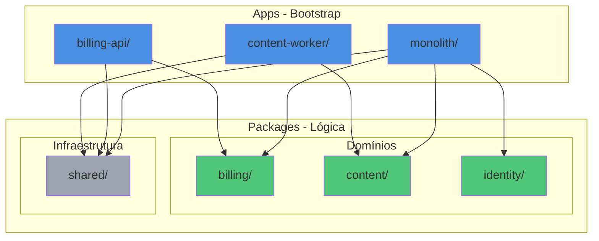
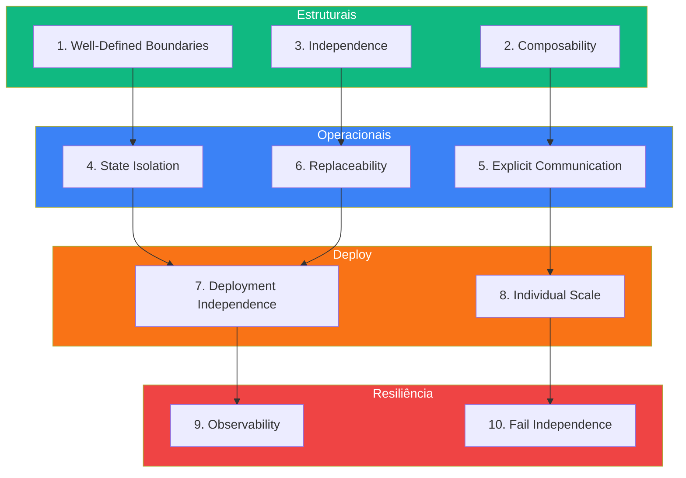
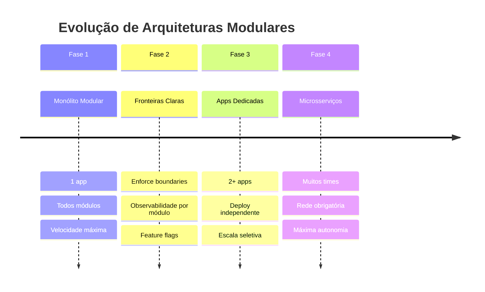

# Arquiteturas Modulares: 10 Princípios para Sistemas Escaláveis Além de Monólitos e Microsserviços

**Waldemar Neto¹, William Calderipe¹**

¹TechLeads.club

---

## Abstract

A indústria de software enfrenta um dilema fundamental de granularidade: monólitos tradicionais sofrem com alta complexidade local e escalabilidade limitada, enquanto microsserviços introduzem complexidade operacional prematura que frequentemente supera seus benefícios. Evidências empíricas recentes, incluindo pesquisas conduzidas por equipes do Google (Ghemawat et al., 2023), demonstram que microsserviços geram perda de performance, visibilidade reduzida, dificuldades de gestão, congelamento de APIs e desaceleração no desenvolvimento. Este trabalho apresenta **Arquiteturas Modulares** como um framework formal posicionado entre esses extremos, baseado na separação consciente entre fronteiras lógicas (módulos) e fronteiras físicas (deploy). Propomos **10 princípios fundamentais** que formam um framework coeso para construir sistemas que evoluem de forma sustentável: Limites Bem Definidos (Well-Defined Boundaries), Componibilidade (Composability), Independência (Independence), Isolamento de Estado (State Isolation), Comunicação Explícita (Explicit Communication), Substituibilidade (Replaceability), Independência de Deploy (Deployment Independence), Escalabilidade Independente (Individual Scale), Observabilidade (Observability) e Falhas Isoladas (Fail Independence). Nossa contribuição principal é a formalização desses princípios como um modelo arquitetural que permite evolução gradual da granularidade, reduzindo carga cognitiva e maximizando velocidade de entrega sem incorrer em complexidade prematura.

**Palavras-chave:** arquitetura de software, modularidade, monorepos, microsserviços, Domain-Driven Design, granularidade de software

---

## Índice

1. [Introdução e Contextualização](#1-introdução-e-contextualização)
2. [Estado da Arte e Limitações](#2-estado-da-arte-e-limitações)
3. [Arquiteturas Modulares - Definição Formal](#3-arquiteturas-modulares---definição-formal)
4. [Os 10 Princípios Fundamentais](#4-os-10-princípios-fundamentais)
5. [Padrões de Implementação](#5-padrões-de-implementação)
6. [Governança Organizacional](#6-governança-organizacional)
7. [Análise Comparativa e Trade-offs](#7-análise-comparativa-e-trade-offs)
8. [Trabalhos Relacionados](#8-trabalhos-relacionados)
9. [Conclusão](#9-conclusão)
10. [Referências](#referências)

---

## 1. Introdução e Contextualização

A evolução das arquiteturas de software nas últimas décadas reflete mudanças profundas tanto em infraestrutura tecnológica quanto em práticas organizacionais. Desde os **monólitos tradicionais** dos anos 1990-2000, passando pela **Service-Oriented Architecture (SOA)** dos anos 2000, até os **microsserviços** que dominaram a década de 2010, cada paradigma trouxe promessas de melhor organização, escalabilidade e manutenibilidade.

### 1.1 O Problema da Granularidade em Software

**Granularidade** define o tamanho e a coesão das unidades que compõem um sistema — sejam elas funções, classes, módulos ou serviços. Esta é uma das decisões arquiteturais mais críticas, pois impacta diretamente:

- **Complexidade técnica**: quantidade de abstrações e pontos de integração
- **Carga cognitiva**: volume de informação que desenvolvedores precisam gerenciar
- **Velocidade de evolução**: facilidade de implementar mudanças

Podemos classificar granularidade em três níveis:

- **Granularidade Grossa (Coarse-grained)**: unidades maiores com múltiplas responsabilidades agrupadas (ex: monólitos tradicionais)
- **Granularidade Média (Medium-grained)**: módulos coesos representando domínios de negócio (ex: arquiteturas modulares)
- **Granularidade Fina (Fine-grained)**: unidades pequenas e específicas com deploy independente (ex: microsserviços)

### 1.2 Mudança de Paradigma: Cloud e Ferramental Moderno

O advento da **computação em nuvem**, **containers**, **orquestração (Kubernetes)** e **serverless** modificou fundamentalmente as possibilidades arquiteturais. Pela primeira vez, tornou-se viável:

- Modularizar sistemas e escalar cada parte independentemente
- Fazer deploys seletivos sem recompilar o sistema inteiro
- Gerenciar dependências complexas com ferramentas sofisticadas (Nx, Bazel, Turborepo)

Paradoxalmente, essa flexibilidade criou um novo desafio: **a complexidade migrou do código para a arquitetura distribuída**. Como observado por Khononov (2023) em "Balancing Coupling in Software Design", a complexidade em sistemas modernos emerge principalmente da **comunicação entre componentes**, não do código interno de cada um.

### 1.3 Complexidade Local vs Global

Em sistemas monolíticos tradicionais, a **complexidade era local**: mudanças em infraestrutura (banco de dados, frameworks) impactavam todo o sistema. A resposta foram camadas rígidas de abstração e padrões como Hexagonal Architecture e Clean Architecture.

Em sistemas modernos distribuídos, a **complexidade é global**: o desafio não é proteger o domínio do ORM, mas garantir contratos claros entre serviços, gerenciar consistência eventual, observabilidade e orquestração de deploys.

### 1.4 Objetivo deste Trabalho

Este paper propõe **Arquiteturas Modulares** como um framework intermediário que:

1. Mantém a **visibilidade e colaboração** de monólitos
2. Oferece a **autonomia e escalabilidade** de microsserviços
3. Evita a **complexidade operacional prematura**
4. Permite **evolução gradual** conforme maturidade organizacional

Formalizamos este conceito através de **10 princípios fundamentais** validados empiricamente em projetos enterprise de empresas como Atlassian, BuildOps e diversas startups de alto crescimento.

---

## 2. Estado da Arte e Limitações

### 2.1 Monólitos Tradicionais

**Características:**
- Todo o código em uma única base (codebase)
- Deploy único e atômico
- Comunicação interna via chamadas de função
- Estado compartilhado (banco de dados monolítico)

**Benefícios:**
- Simplicidade operacional
- Transações ACID nativas
- Debugging facilitado
- Menor overhead de rede

**Limitações:**
- Escalabilidade limitada (escala tudo ou nada)
- Alto acoplamento acidental
- Mudanças arriscadas (blast radius grande)
- Dificuldade de paralelização de equipes

### 2.2 Microsserviços: Promessas vs Realidade

A arquitetura de microsserviços foi amplamente adotada com promessas de:

- Escalabilidade individual por serviço
- Isolamento de falhas
- Ciclos de release independentes
- Autonomia de equipes
- Fronteiras de abstração claras

### 2.3 Evidências Empíricas dos Problemas

O artigo "Towards Modern Development of Cloud Applications" (Ghemawat et al., 2023), publicado no HotOS e desenvolvido por pesquisadores do Google, incluindo Sanjay Ghemawat (cocriador do MapReduce e Google File System), identifica **cinco problemas sistêmicos** em microsserviços:

#### 2.3.1 Perda de Performance
A serialização de dados e chamadas via rede adicionam overhead significativo comparado a chamadas locais. Quanto mais fragmentado o sistema, maior o custo de comunicação.

#### 2.3.2 Perda de Visibilidade
Com múltiplas versões de múltiplos serviços em produção simultaneamente, torna-se extremamente difícil prever comportamentos emergentes. A maioria das falhas críticas ocorre na **interação entre versões diferentes** de serviços.

#### 2.3.3 Dificuldade de Gestão
Cada serviço vira um binário independente com processo próprio de build, teste e deploy. O esforço para manter tudo funcionando em conjunto cresce exponencialmente.

#### 2.3.4 Congelamento de APIs
Ao publicar uma API entre serviços, você congela sua evolução. APIs antigas persistem indefinidamente porque não há visibilidade de quem as consome, criando débito técnico cumulativo.

#### 2.3.5 Desaceleração no Desenvolvimento
Alterações que afetam múltiplos serviços não podem ser feitas atomicamente. Desenvolvedores precisam orquestrar mudanças entre N serviços com versões desalinhadas, reduzindo drasticamente a velocidade de entrega.

### 2.4 O Erro Fundamental

Segundo Ghemawat et al. (2023), o erro dos microsserviços está em **conflitar fronteiras lógicas (código) com fronteiras físicas (deploy)**:

- Microsserviços forçam decisões de deploy no momento da escrita do código
- Isso engessa o sistema: contratos e pontos de integração ficam imutáveis
- Desfazer a separação ou reorganizar torna-se quase impossível

### 2.5 Tabela Comparativa: Granularidade

| **Critério** | **Grossa (Monólito)** | **Média (Modular)** | **Fina (Microsserviços)** |
|---|---|---|---|
| **Complexidade Operacional** | Baixa | Média | Alta |
| **Velocidade Inicial** | Alta | Alta | Baixa |
| **Escalabilidade** | Limitada | Flexível | Máxima |
| **Visibilidade do Sistema** | Total | Alta | Fragmentada |
| **Deploy** | Único | Por app | Por serviço |
| **Acoplamento** | Alto | Controlado | Distribuído |
| **Governança Necessária** | Baixa | Média | Alta |


**Figura 1: Sweet Spot da Complexidade Operacional**  
*As Arquiteturas Modulares ocupam o ponto de mínima complexidade operacional, equilibrando os benefícios de monólitos (simplicidade) com os de microsserviços (autonomia), evitando os problemas de ambos os extremos.*

### 2.6 Gap Identificado

Não existe framework formal que permita:
- Começar simples e evoluir gradualmente
- Separar decisões de modularização de decisões de deploy
- Manter visibilidade total enquanto oferece autonomia
- Evitar compromissos irreversíveis de granularidade

**Arquiteturas Modulares** preenchem esse gap.

---

## 3. Arquiteturas Modulares - Definição Formal

### 3.1 Definição

> **Arquitetura Modular** é um sistema de software que estabelece **separação explícita entre fronteiras lógicas (módulos)** e **fronteiras físicas (processos/deploys)**, permitindo que a granularidade evolua de forma incremental e reversível conforme necessidades do negócio e maturidade organizacional.

### 3.2 Características Fundamentais

#### 3.2.1 Modularização em Monorepo
Todo o código vive em um único repositório versionado, organizado em:
- **Apps**: pontos de bootstrap que orquestram módulos
- **Packages**: unidades lógicas contendo domínios de negócio ou infraestrutura

#### 3.2.2 Deploy Independente como Opção
Módulos **podem** ser deployados juntos (monólito modular) ou separados (apps dedicadas), sem exigir refatoração do código. A decisão de deploy é **operacional**, não **estrutural**.

#### 3.2.3 Evolução Gradual
A arquitetura suporta transições naturais:
```
Monólito Modular → Módulos com Fronteiras Claras → 
Apps Dedicadas → Microsserviços (quando justificado)
```

### 3.3 Componentes Arquiteturais

#### 3.3.1 Apps (Pontos de Bootstrap)
Apps são executáveis que importam e inicializam módulos. Não contêm lógica de negócio.

```
apps/
  monolith/              # Importa todos os módulos
    main.ts              # Bootstrap
    monolith.module.ts   # Orquestração
  billing-api/           # Importa apenas Billing
    main.ts
    billing-api.module.ts
```

#### 3.3.2 Packages (Unidades Lógicas)

**Módulos de Domínio**: encapsulam regras de negócio de um Bounded Context (DDD)
```
packages/
  billing/
    core/               # Entidades, casos de uso
    persistence/        # Repositórios, migrations
    http/              # Controllers, DTOs
    __test__/          # Testes isolados
```

**Módulos de Infraestrutura**: fornecem capacidades técnicas reutilizáveis
```
packages/
  shared/
    logger/
    config/
    database/
```

#### 3.3.3 Grafo de Dependências Explícito
Ferramentas como Nx constroem automaticamente um grafo mostrando como módulos se relacionam, permitindo:
- Detecção de dependências circulares
- Execução de testes apenas em módulos afetados (`nx affected`)
- Builds incrementais

```
monorepo-root/
│
├── apps/                          [Apps = Bootstrap]
│   ├── monolith/                     ← Importa todos os módulos
│   │   ├── main.ts
│   │   └── monolith.module.ts
│   │
│   ├── billing-api/                  ← Apenas Billing
│   │   ├── main.ts
│   │   └── billing-api.module.ts
│   │
│   └── content-worker/               ← Apenas Content/VideoProcessor
│       ├── main.ts
│       └── content-worker.module.ts
│
├── packages/                      [Packages = Lógica]
│   │
│   ├── DOMÍNIOS
│   │   │
│   │   ├── billing/                  ← Bounded Context
│   │   │   ├── core/                 (entidades, casos de uso)
│   │   │   ├── persistence/          (repositórios, migrations)
│   │   │   ├── http/                 (controllers, DTOs)
│   │   │   └── __test__/
│   │   │
│   │   ├── content/
│   │   │   ├── catalog/              ← Submódulo
│   │   │   ├── video-processor/      ← Submódulo
│   │   │   └── admin/                ← Submódulo
│   │   │
│   │   └── identity/
│   │       ├── core/
│   │       ├── persistence/
│   │       └── http/
│   │
│   └── INFRAESTRUTURA
│       └── shared/
│           ├── logger/               (sem lógica de negócio)
│           ├── config/
│           └── database/
│
├── tools/
│   └── scripts/
│
├── nx.json                           [Configuração Nx]
├── package.json
└── tsconfig.base.json
```

### 3.4 Ferramental Habilitador

Arquiteturas Modulares são viabilizadas por ferramentas modernas:

| **Tecnologia** | **Capacidade** | **Exemplos** |
|---|---|---|
| **Monorepo Tools** | Gerenciamento de dependências, builds incrementais | Nx, Bazel, Turborepo |
| **Frameworks Modulares** | Composição via módulos, injeção de dependências | NestJS, Spring Boot, .NET |
| **Modularização Nativa** | Sistemas de módulos em linguagens | Java Modules, Go packages |
| **Soluções Integradas** | Deploy flexível mantendo modularidade | Service Weaver, Java Modulith |

### 3.5 Diferenciação Fundamental

| **Aspecto** | **Microsserviços** | **Arquiteturas Modulares** |
|---|---|---|
| **Decisão de Deploy** | Definida na arquitetura | Separada da arquitetura |
| **Granularidade** | Fixa desde o início | Evolui gradualmente |
| **Reversibilidade** | Difícil | Natural |
| **Complexidade Inicial** | Alta | Baixa |
| **Visibilidade** | Fragmentada | Total (monorepo) |



---

## 4. Os 10 Princípios Fundamentais

Este framework é estruturado em quatro categorias de princípios, cada uma abordando um aspecto fundamental da modularidade.

### 4.1 Princípios Estruturais

Definem a **base da organização modular**.

#### 4.1.1 Well-Defined Boundaries (Limites Bem Definidos)

**Definição:** Cada módulo possui responsabilidades claras alinhadas a um Bounded Context (DDD), sem expor detalhes internos para outros módulos.

**Justificativa:** Limites claros reduzem acoplamento acidental, facilitam manutenção e permitem evolução independente. Seguem o princípio de encapsulamento estendido para nível arquitetural.

**Implementação:**

Os exemplos a seguir mostram o setup de um módulo em diferentes linguagens. O conceito se aplica a qualquer tecnologia - **módulos podem ser implementados com ou sem frameworks**, usando convenções de organização e encapsulamento nativas da linguagem.

**NestJS (TypeScript) - com framework:**
```typescript
// packages/billing/billing.module.ts
@Module({
  imports: [TypeOrmModule.forFeature([SubscriptionEntity])],
  providers: [BillingService],
  controllers: [BillingController],
  exports: []  // Nada exportado - comunicação via HTTP/eventos
})
export class BillingModule {}
```

**Go (sem framework) - apenas convenções:**
```go
// packages/billing/module.go
package billing

// Setup do módulo - função pública de inicialização
func Setup(router *mux.Router, db *sql.DB) {
    // Componentes internos (não exportados)
    repo := newRepository(db)
    service := newService(repo)
    
    // Apenas rotas HTTP são expostas
    setupRoutes(router, service)
}
```

**Ktor (Kotlin) - convenções + extension functions:**
```kotlin
// packages/billing/BillingModule.kt
package com.example.billing

fun Application.billingModule() {
    // Componentes internos
    val repository = BillingRepository(database)
    val service = BillingService(repository)
    
    // Apenas rotas são expostas
    routing {
        billingRoutes(service)
    }
}
```

**Princípio universal:** O módulo é uma **unidade organizacional** que:
- Agrupa componentes relacionados (repositórios, services, controllers)
- Expõe apenas pontos de entrada públicos (APIs, eventos)
- Mantém implementações internas privadas usando visibilidade da linguagem

**Violação comum:** Módulos que exportam repositórios ou entidades internas permitem que outros dependam de detalhes de implementação.

#### 4.1.2 Composability (Componibilidade)

**Definição:** Módulos são projetados como blocos reutilizáveis que podem ser combinados para formar diferentes aplicações ou funcionalidades.

**Justificativa:** Maximiza reuso, reduz duplicação e permite evolução incremental sem reescrever código.

**Implementação:**
```typescript
// monolith.module.ts (importa tudo)
@Module({
  imports: [BillingModule, ContentModule, IdentityModule, LoggerModule]
})
export class MonolithModule {}

// billing-api.module.ts (importa apenas billing)
@Module({
  imports: [BillingModule, LoggerModule]
})
export class BillingApiModule {}
```

**Benefício:** Mesmos módulos podem ser orquestrados de formas diferentes sem duplicar código.

#### 4.1.3 Independence (Independência)

**Definição:** Módulos são autônomos em código e infraestrutura, comunicando-se apenas via APIs explícitas, eventos ou mensagens assíncronas.

**Justificativa:** Previne acoplamento acidental, permite evolução tecnológica independente e facilita testes isolados.

**Implementação:**
- Cada módulo possui suas próprias variáveis de ambiente
- Comunicação via HTTP, gRPC ou mensageria (nunca importação direta)
- Testes executam sem necessidade de outros módulos

**Regra:** Se módulo A precisa de dados de módulo B, usa API ou evento — nunca importa classes de B diretamente.

### 4.2 Princípios Operacionais

Definem **como módulos interagem**.

#### 4.2.1 State Isolation (Isolamento de Estado)

**Definição:** Cada módulo gerencia seu próprio estado (banco de dados, cache, filas) sem compartilhamento direto com outros módulos.

**Justificativa:** Previne falhas em cascata, permite escalabilidade independente e facilita evolução de schemas.

**Implementação:**
```typescript
// billing.module.ts
@Module({
  imports: [
    TypeOrmModule.forRoot({
      type: 'postgres',
      host: process.env.BILLING_DB_HOST,
      database: process.env.BILLING_DB_NAME,
      entities: [SubscriptionEntity], // Apenas entidades do banco de dados locais
      migrations: ['dist/packages/billing/migrations/*.js']
    })
  ]
})
```

**Estratégias de banco:**
- **Banco Compartilhado**: schemas ou tabelas separadas (boa para início)
- **Bancos Separados**: isolamento físico total (boa para maturidade)

#### 4.2.2 Explicit Communication (Comunicação Explícita)

**Definição:** Toda comunicação entre módulos ocorre via contratos bem definidos (interfaces, DTOs, schemas de eventos).

**Justificativa:** Evita acoplamento implícito, permite versionamento de contratos e facilita testes com mocks.

**Implementação:**

**Local (mesmo processo):**
```typescript
// Interface pública
export interface BillingAPI {
  createSubscription(userId: string, planId: string): Promise<Subscription>;
}

// Implementação
@Injectable()
export class BillingService implements BillingAPI {
  async createSubscription(...) { /* lógica */ }
}
```

**Remoto (processos separados):**
```typescript
@Controller('billing')
export class BillingController {
  @Post('subscribe')
  async createSubscription(@Body() dto: CreateSubscriptionDto) { /* ... */ }
}
```

**Assíncrono (eventos):**
```typescript
@OnEvent('billing.subscription.created')
handleSubscriptionCreated(payload: SubscriptionCreatedEvent) { /* ... */ }
```

#### 4.2.3 Replaceability (Substituibilidade)

**Definição:** Módulos podem ser removidos, alterados ou substituídos sem afetar o restante da arquitetura.

**Justificativa:** Permite experimentação tecnológica, reduz vendor lock-in e facilita refatorações.

**Implementação:**
- Módulos não exportam classes concretas
- Dependências externas são abstraídas via interfaces
- Contratos públicos permanecem estáveis enquanto implementações mudam

**Exemplo:** Trocar ORM (TypeORM → Prisma) dentro de um módulo sem impactar consumidores.

### 4.3 Princípios de Deploy

Definem **flexibilidade de implantação**.

#### 4.3.1 Deployment Independence (Deploy Independente)

**Definição:** Cada app pode ser versionada e implantada isoladamente, sem obrigar deploys de outras apps.

**Justificativa:** Reduz risco de mudanças, permite ciclos de release diferenciados e facilita rollbacks.

**Implementação:**
```yaml
# CI/CD Pipeline (exemplo GitHub Actions)
name: Deploy Billing API
on:
  push:
    branches: [main]
jobs:
  check-affected:
    runs-on: ubuntu-latest
    steps:
      - run: npx nx affected:apps --base=origin/main
      - if: contains(steps.affected.outputs.apps, 'billing-api')
        run: npx nx build billing-api && npm run deploy:billing-api
```

**Estratégia:** Usar `nx affected` para detectar mudanças e deployar apenas apps impactadas.

#### 4.3.2 Individual Scale (Escalabilidade Independente)

**Definição:** Cada app pode escalar horizontalmente conforme sua demanda específica, sem afetar outros.

**Justificativa:** Otimiza uso de recursos e previne que gargalos locais impactem o sistema inteiro.

**Implementação:**
```yaml
# Kubernetes HPA
apiVersion: autoscaling/v2
kind: HorizontalPodAutoscaler
metadata:
  name: billing-hpa
spec:
  scaleTargetRef:
    kind: Deployment
    name: billing-deployment
  minReplicas: 2
  maxReplicas: 10
  metrics:
    - type: Resource
      resource:
        name: cpu
        target:
          averageUtilization: 70
```

**Estratégia:** Métricas por app determinam escala independente.

### 4.4 Princípios de Resiliência

Definem **operação confiável em produção**.

#### 4.4.1 Observability (Observabilidade)

**Definição:** Cada módulo possui logs, métricas e tracing próprios, permitindo diagnóstico isolado.

**Justificativa:** Identifica problemas rapidamente sem vasculhar o sistema inteiro.

**Implementação:**
```typescript
// Logs com contexto de módulo
logger.log('Subscription created', { 
  module: 'billing',
  userId, 
  planId 
});

// Métricas por módulo
@Metrics({ module: 'billing' })
export class BillingService { /* ... */ }
```

**Ferramental:** Prometheus (métricas), Grafana (dashboards), Jaeger (tracing distribuído).

#### 4.4.2 Fail Independence (Falhas Isoladas)

**Definição:** Falhas em um módulo não se propagam, garantindo degradação controlada do sistema.

**Justificativa:** Maximiza disponibilidade e facilita recuperação.

**Implementação:**
```typescript
// Circuit Breaker
import CircuitBreaker from 'opossum';

@Injectable()
export class BillingClient {
  private breaker = new CircuitBreaker(
    () => this.callBillingAPI(),
    { timeout: 5000, errorThresholdPercentage: 50 }
  );
  
  async getBillingData() {
    try {
      return await this.breaker.fire();
    } catch (err) {
      // Fallback
      return { status: 'degraded', data: null };
    }
  }
}
```

**Estratégias:** Circuit breakers, timeouts, retries com backoff exponencial, fallbacks.

## Os 10 princípios organizados


---

## 5. Padrões de Implementação

### 5.1 Tipos de Módulos

#### 5.1.1 Módulos de Domínio
Representam Bounded Contexts (DDD) e encapsulam regras de negócio específicas.

**Exemplos:** `billing/`, `content/`, `identity/`

**Estrutura típica:**
```
billing/
├── core/              # Entidades, serviços, casos de uso
├── persistence/       # Repositórios, migrations
├── http/              # Controllers, DTOs
└── __test__/          # Testes unitários e E2E
```

#### 5.1.2 Módulos de Infraestrutura (Shared)
Fornecem capacidades técnicas reutilizáveis, sem lógica de negócio.

**Exemplos:** `shared/logger/`, `shared/config/`, `shared/database/`

**Regra:** Nunca incluir regras de negócio em shared. Se dois domínios compartilham lógica, isso indica fronteira mal definida.

### 5.2 Submódulos

Quando domínios ficam muito grandes, dividem-se em **submódulos** mantendo coesão do Bounded Context.

**Exemplo:**
```
content/
├── catalog/           # Submódulo: gerenciamento de catálogo
├── video-processor/   # Submódulo: processamento de vídeos
└── admin/             # Submódulo: administração de conteúdo
```

**Benefícios:**
- Maior coesão interna
- Compartilhamento controlado dentro do domínio
- Escala separada (ex: video-processor pode rodar como worker isolado)

**Regra:** Submódulos podem compartilhar entidades e repositórios, mas **nunca** services ou lógica de aplicação.

### 5.3 Design Patterns de Apps

#### 5.3.1 Padrão 1: App Compartilhada + Apps de Domínio

**Estrutura:**
```
apps/
  monolith/            # App compartilhada (todos os módulos)
  billing-api/         # App dedicada (apenas Billing)
  content-worker/      # App dedicada (apenas Content/VideoProcessor)
```

**Quando usar:**
- Empresas pequenas/médias
- Domínios ainda em descoberta
- Necessidade de velocidade inicial

**Vantagens:**
- Baixa complexidade operacional
- Fácil adicionar novos módulos
- Permite promoção gradual para apps dedicadas

**Desafios:**
- On-call compartilhado (requer alertas por módulo)
- Deploys conjuntos (usar feature flags)

#### 5.3.2 Padrão 2: Apps por Domínio

**Estrutura:**
```
apps/
  billing-app/         # Apenas módulos de Billing
  content-app/         # Apenas módulos de Content
  identity-app/        # Apenas módulos de Identity
```

**Quando usar:**
- Domínios bem estabelecidos
- Times maduros
- Necessidade de isolamento forte

**Vantagens:**
- Máxima autonomia
- Pipelines independentes
- Escala granular

**Desafios:**
- Maior overhead operacional
- Risco de granularidade excessiva

### 5.4 Estratégia de Evolução

**Fase 1: Monólito Modular**
- Uma app compartilhada
- Todos os módulos juntos
- Fronteiras lógicas definidas

**Fase 2: Módulos com Fronteiras Claras**
- Ainda uma app compartilhada
- Governança forte (linters, enforce-module-boundaries)
- Observabilidade por módulo

**Fase 3: Apps Dedicadas**
- Módulos críticos promovidos para apps próprias
- Deploy e escala independentes
- App compartilhada ainda existe para módulos menores

**Fase 4: Extração para Microsserviços**
- Apenas quando necessário (compliance, escala extrema)
- Comunicação exclusivamente via rede
- Custo operacional justificado



---

## 6. Governança Organizacional

### 6.1 Arquitetura Conway Invertida

A Lei de Conway estabelece que sistemas refletem estruturas organizacionais. Em Arquiteturas Modulares, invertemos isso: **a estrutura do código influencia a organização**.

Módulos bem definidos naturalmente criam:
- Ownership claro
- Autonomia de times
- Redução de dependências organizacionais

### 6.2 Responsabilidades dos Tech Leads

Líderes técnicos em arquiteturas modulares devem:

1. **Estabelecer Diretrizes de Separação**
   - Quando criar novo módulo
   - Quando promover módulo para app dedicada
   - Critérios de coesão e acoplamento

2. **Garantir Observabilidade por Módulo**
   - Dashboards dedicados
   - Alertas direcionados aos times responsáveis
   - Playbooks de incidentes

3. **Balancear Autonomia e Coerência**
   - Autonomia: times escolhem implementações
   - Coerência: contratos e padrões são consistentes

4. **Gerenciar Evolução Arquitetural**
   - Revisar grafo de dependências periodicamente
   - Identificar acoplamentos acidentais
   - Facilitar refatorações de fronteiras

### 6.3 Versionamento: Fast Forward vs Time Machine

#### 6.3.1 Fast Forward (Monorepo)
- Todos sempre na última versão
- Zero "bump hell"
- Pipeline garante consistência via `nx affected`
- **Ideal para velocidade e consistência**

#### 6.3.2 Time Machine (Polyrepo)
- Cada pacote com versão própria
- Possibilidade de ficar em versões antigas
- Alto custo de sincronização
- **Gera complexidade de manutenção**

**Recomendação:** Fast Forward para arquiteturas evolutivas.

### 6.4 Desafios Operacionais

#### 6.4.1 On-Call Compartilhado
**Problema:** Quem atende alertas quando múltiplos times compartilham uma app?

**Solução:**
- Alertas com tag de módulo
- Roteamento automático baseado em ownership
- Dashboards separados por domínio

#### 6.4.2 Gestão de Dependências
**Problema:** Módulos podem criar dependências circulares ou indesejadas.

**Solução:**
```json
// nx.json - enforce-module-boundaries
{
  "tags": {
    "domain:billing": ["domain:billing", "shared"],
    "domain:content": ["domain:content", "shared"],
    "shared": []
  }
}
```

Regra: Domínios só dependem de shared, nunca entre si.

#### 6.4.3 Feature Flags para Deploys Conjuntos
**Problema:** Deploys de app compartilhada afetam múltiplos times.

**Solução:**
```typescript
if (featureFlags.isEnabled('billing-new-checkout', userId)) {
  return newCheckoutFlow();
}
return legacyCheckoutFlow();
```

---

## 7. Análise Comparativa e Trade-offs

### 7.1 Tabela Comparativa Detalhada

| **Critério** | **Monólito** | **Modular** | **Microsserviços** |
|---|---|---|---|
| **Complexidade Operacional** | Baixa | Média | Alta |
| **Velocidade Inicial** | Alta | Alta | Baixa |
| **Escalabilidade** | Vertical | Horizontal seletiva | Horizontal total |
| **Visibilidade** | Total | Total (monorepo) | Fragmentada |
| **Deploy** | Único | Por app | Por serviço |
| **Acoplamento** | Alto | Controlado | Distribuído |
| **Carga Cognitiva** | Alta (local) | Média | Alta (global) |
| **Custo Operacional** | Baixo | Médio | Alto |
| **Autonomia de Times** | Baixa | Média-Alta | Alta |
| **Reversibilidade** | Difícil | Fácil | Muito difícil |

### 7.2 Quando Usar Arquiteturas Modulares

**Sim, quando:**
- Times médios a grandes (5-100+ pessoas)
- Domínios em evolução ou descoberta
- Necessidade de colaboração frequente entre times
- Requisitos mistos de escala (alguns módulos precisam escalar, outros não)
- Cultura de monorepo estabelecida
- Prioridade em velocidade de entrega

### 7.3 Quando NÃO Usar

**Considere alternativas quando:**

**Preferir Monólito Simples:**
- Sistema muito pequeno (1-3 desenvolvedores)
- Domínio extremamente simples
- Prototipação rápida

**Preferir Microsserviços:**
- Domínios totalmente estáveis e isolados
- Necessidade de isolamento físico total (compliance, regulatório)
- Times completamente independentes geograficamente
- Requisitos extremos de escala heterogênea

### 7.4 Limitações Identificadas

1. **Requer Disciplina de Governança**
   - Sem enforcement, fronteiras se degradam
   - Necessita líderes técnicos ativos

2. **Ferramental Específico**
   - Nx, Bazel ou equivalente são necessários
   - Curva de aprendizado inicial

3. **Banco de Dados Compartilhado**
   - Se usar banco único, depende de disciplina para isolamento
   - Sem garantias físicas de separação

4. **Cultura de Monorepo**
   - Times acostumados com polyrepo podem resistir
   - Exige mudança cultural

**[Figura 5: Matriz de Decisão — ver diagrams-spec.md]**

---

## 8. Trabalhos Relacionados

### 8.1 Domain-Driven Design (Evans, 2003)

**Contribuição:** Conceito de **Bounded Contexts** como unidades de modelagem.

**Relação:** Arquiteturas Modulares implementam Bounded Contexts como módulos de domínio, com fronteiras técnicas além das conceituais.

**Referência:** Evans, E. (2003). *Domain-Driven Design: Tackling Complexity in the Heart of Software*. Addison-Wesley.

### 8.2 Towards Modern Development of Cloud Applications (Ghemawat et al., 2023)

**Contribuição:** Evidências empíricas dos problemas sistêmicos de microsserviços.

**Relação:** Valida a necessidade de separar fronteiras lógicas de físicas, base conceitual deste trabalho.

**Referência:** Ghemawat, S., et al. (2023). Towards Modern Development of Cloud Applications. *HotOS '23*.

### 8.3 Service Weaver (Google, 2023)

**Contribuição:** Framework que permite escrever código monolítico e deployar como microsserviços.

**Relação:** Implementação prática de modularidade com deploy flexível, validando conceitos aqui propostos.

**Diferença:** Service Weaver foca em Go; este framework é agnóstico de linguagem.

### 8.4 Java Modulith (Spring Ecosystem)

**Contribuição:** Modularidade no ecossistema Java Spring Boot.

**Relação:** Implementa princípios similares de Bounded Contexts em monorepos Java.

**Diferença:** Específico para Java; este trabalho generaliza para múltiplas linguagens.

### 8.5 Balancing Coupling in Software Design (Khononov, 2023)

**Contribuição:** Análise de complexidade global vs local em sistemas distribuídos.

**Relação:** Fundamenta o argumento de que complexidade moderna está na comunicação, não no código interno.

**Referência:** Khononov, V. (2023). *Balancing Coupling in Software Design*. Addison-Wesley.

### 8.6 Nx Documentation (Nrwl)

**Contribuição:** Práticas e padrões de monorepo com foco em modularidade.

**Relação:** Ferramental que viabiliza implementação prática dos princípios.

**Referência:** Nrwl. (2024). *Nx Documentation*. https://nx.dev

### 8.7 Diferenciação deste Trabalho

Este paper vai além ao:
1. **Formalizar 10 princípios** como framework coeso
2. **Propor padrões de implementação** validados empiricamente
3. **Incluir governança organizacional** como parte integral
4. **Estabelecer estratégia de evolução** gradual entre paradigmas

---

## 9. Conclusão

### 9.1 Síntese

Arquiteturas Modulares representam um **"meio-termo consciente"** entre monólitos tradicionais e microsserviços, fundamentado em:

- **Separação explícita** entre fronteiras lógicas e físicas
- **Evolução gradual** da granularidade conforme maturidade
- **Visibilidade total** via monorepo mantendo autonomia
- **Complexidade controlada** evitando overhead prematuro

### 9.2 Contribuições Principais

Este trabalho oferece:

1. **Framework Formal com 10 Princípios**
   - Estruturais: Boundaries, Composability, Independence
   - Operacionais: State Isolation, Communication, Replaceability
   - Deploy: Deployment Independence, Individual Scale
   - Resiliência: Observability, Fail Independence

2. **Padrões de Implementação Validados**
   - Tipos de módulos (domínio vs infraestrutura)
   - Submódulos para domínios grandes
   - Design patterns de apps (compartilhada vs dedicada)

3. **Modelo de Governança Organizacional**
   - Responsabilidades de tech leads
   - Versionamento Fast Forward
   - Gestão de desafios operacionais

4. **Estratégia de Evolução Gradual**
   - 4 fases: Monólito Modular → Fronteiras Claras → Apps Dedicadas → Microsserviços
   - Decisões reversíveis em cada fase

### 9.3 Posicionamento

Arquiteturas Modulares **não são revolução**, mas **evolução natural** de:
- Domain-Driven Design (conceitos)
- Ferramental moderno (viabilização técnica)
- Evidências empíricas (validação científica)

### 9.4 Trabalhos Futuros

Direções de pesquisa:

1. **Métricas Quantitativas de Carga Cognitiva**
   - Formalizar métricas para medir complexidade percebida
   - Comparar com monólitos e microsserviços

2. **Estudos de Caso Longitudinais**
   - Acompanhar evolução de sistemas reais ao longo de anos
   - Validar hipótese de redução de débito técnico

3. **Validação em Diferentes Ecossistemas**
   - Java, Go, .NET, Python
   - Identificar padrões universais vs específicos de linguagem

4. **Ferramental de Governança Automatizada**
   - Análise estática de violações de princípios
   - Sugestões automatizadas de refatorações

### 9.5 Abertura

Este trabalho é uma **contribuição aberta para a comunidade**. Encorajamos:
- Feedback e críticas construtivas
- Implementações em diferentes contextos
- Validação empírica em novos domínios
- Extensões e refinamentos do framework

---

## Referências

1. Evans, E. (2003). *Domain-Driven Design: Tackling Complexity in the Heart of Software*. Addison-Wesley Professional.

2. Ghemawat, S., Grandl, R., Petrovic, S., Schwarzkopf, M., Whittaker, M., & McKinley, K. S. (2023). Towards Modern Development of Cloud Applications. In *Proceedings of the 19th Workshop on Hot Topics in Operating Systems (HotOS '23)*. ACM. https://doi.org/10.1145/3593856.3595909

3. Khononov, V. (2023). *Balancing Coupling in Software Design: Successful Software Architecture in General and Distributed Systems in Particular*. Addison-Wesley Professional.

4. Newman, S. (2021). *Building Microservices: Designing Fine-Grained Systems* (2nd ed.). O'Reilly Media.

5. Nrwl. (2024). *Nx: Smart Monorepos · Fast CI*. Retrieved from https://nx.dev

6. Google. (2023). *Service Weaver: A Framework for Writing Distributed Applications*. Retrieved from https://serviceweaver.dev

7. Spring. (2024). *Modulith: A Modular Monolith Toolkit for Spring Boot*. Retrieved from https://spring.io/projects/spring-modulith

8. Fowler, M. (2014). *Microservices: A Definition of This New Architectural Term*. Retrieved from https://martinfowler.com/articles/microservices.html

9. Vernon, V. (2013). *Implementing Domain-Driven Design*. Addison-Wesley Professional.

10. Richardson, C. (2018). *Microservices Patterns: With Examples in Java*. Manning Publications.

---

## Sobre os Autores

**Waldemar Neto** é cofundador da TechLeads.club e possui experiência em arquitetura de software em empresas como ThoughtWorks e startups de alto crescimento. Especialista em sistemas evolutivos e práticas de engenharia de software.

**William Calderipe** é cofundador da TechLeads.club com experiência em desenvolvimento enterprise na Atlassian e outras organizações de larga escala. Foco em arquiteturas escaláveis e práticas de DevOps.

---

**Contato:**
- Website: https://techleads.club
- Email: contato@techleads.club
- Twitter/X: @techleadsclub

**Licença:** Este trabalho está licenciado sob Creative Commons Attribution-NonCommercial-ShareAlike 4.0 International (CC BY-NC-SA 4.0).

**Como citar este trabalho:**
```
Neto, W., & Calderipe, W. (2025). Arquiteturas Modulares: Um Framework de 10 
Princípios para Sistemas Sustentáveis. TechLeads.club Whitepaper, v1.0.
```

---

**Versão:** 1.0  
**Data de Publicação:** 13 de Outubro de 2025  
**Status:** Publicação Inicial — Feedback bem-vindo

